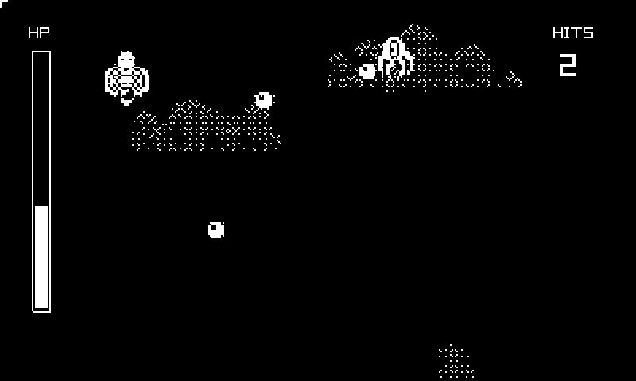

# Basilevs — Playdate port

A 1-bit bullet-hell shmup on the Playdate, ported from
[**bredlej/basilevs**](https://github.com/bredlej/basilevs) — the original
game by **bredlej** (a.k.a. geoco), a C++20/raylib project — to C11 on the
[raylib-pd](../raylib-pd/) backend.



> **Full credit for the game design, art, sound, and level timeline goes to
> bredlej.** This is an unofficial Playdate port; the upstream repository is
> the original work: <https://github.com/bredlej/basilevs>.

- **[Player manual → MANUAL.md](MANUAL.md)** — premise, controls,
  enemies, bullet patterns, and tips.
- **[itch.io page copy → itch/PAGE.md](itch/PAGE.md)**

## Play it

Grab a prebuilt `Basilevs.pdx.zip` from the **Releases** page (or the
`dist/` folder) and either sideload it at
<https://play.date/account/sideload/> or unzip the `.pdx` into the Playdate
Simulator. No SDK or build toolchain required to play.

## Provenance and licensing

- Upstream **basilevs** is by bredlej and is **MIT-licensed** (per its
  README). This port is likewise **MIT**, with attribution to bredlej; see
  [LICENSE](LICENSE).
- `resources/` and `resources-src/` contain the **original art, sound, and
  music by bredlej**, copied unmodified from the upstream `assets/`
  directory.
- The C sources in `src/` are an independent reimplementation of the
  gameplay (entity behaviours, bullet patterns, spawn timeline, constants)
  written for this port; they contain no upstream code.

## Why a rewrite rather than a recompile

Upstream is C++20 (concepts + ranges) over raylib-cpp, boost::sml, and
nlohmann/json, with the level loaded from JSON via `fstream`. The Playdate
device toolchain is arm-none-eabi-gcc 9.2.1: no `<ranges>`/`<concepts>`,
and exceptions/iostream are unwelcome on the device. The game logic itself
is ~1,700 lines with simple state machines, so a faithful C11 rewrite
against raylib-pd was smaller than making the C++ stack device-safe.

## Fidelity notes

- The world simulates on the original **160x144** playfield (the upstream
  render-texture resolution) and is scaled to 267x240 on the LCD; all
  upstream coordinates, collision radii, speeds and timers are unchanged.
- Level 1's spawn timeline is the upstream `assets/json/level1.json`,
  converted to a static C table.
- Kept quirks: enemies die from a single hit (upstream never decrements
  enemy hp); the player's fire timer only advances toward the first shot
  while the button is held; enemies begin shooting during their approach.
- Playdate additions (upstream is WIP and lacked them): a title screen
  using the shipped-but-unused `basilevs.png` art, HP bar and hit counter
  in the screen gutters, a game-over/retry state, player clamped to the
  playfield, and the bundled `music.mp3` actually playing.

## Controls

| Playdate | Action |
| --- | --- |
| d-pad | move |
| A (hold) | shoot |
| B | restart |

## Build

Needs the Playdate SDK (`SDK=...` if not in `~/Developer/PlaydateSDK`) and
the sibling `../raylib-pd` checkout.

```sh
make        # basilevs.pdx, universal (simulator + device)
make run    # open in the Playdate Simulator
```
